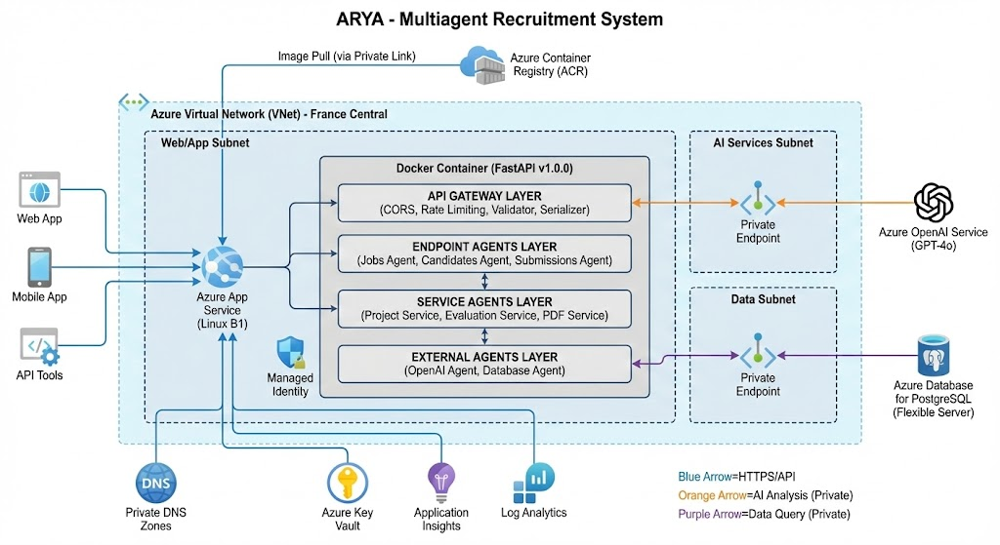
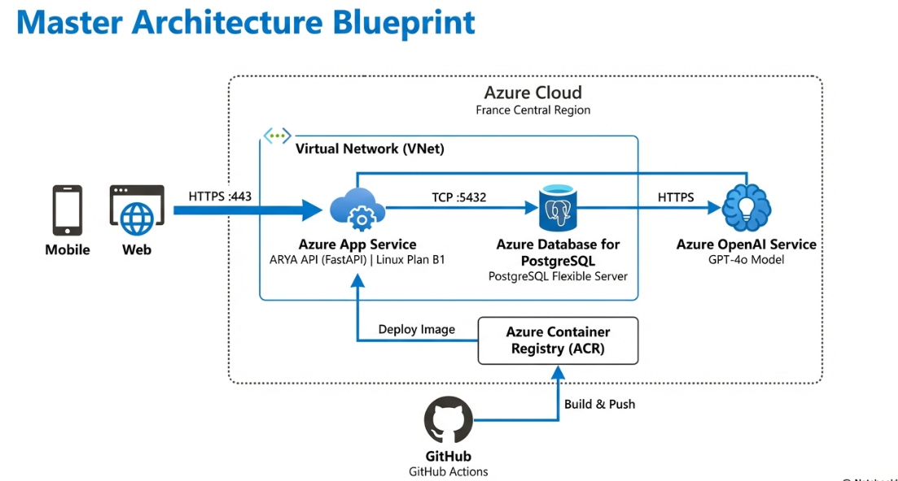
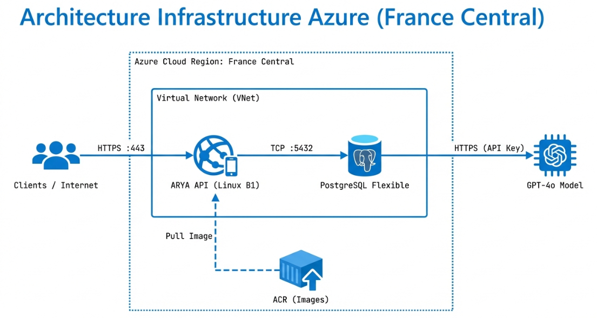
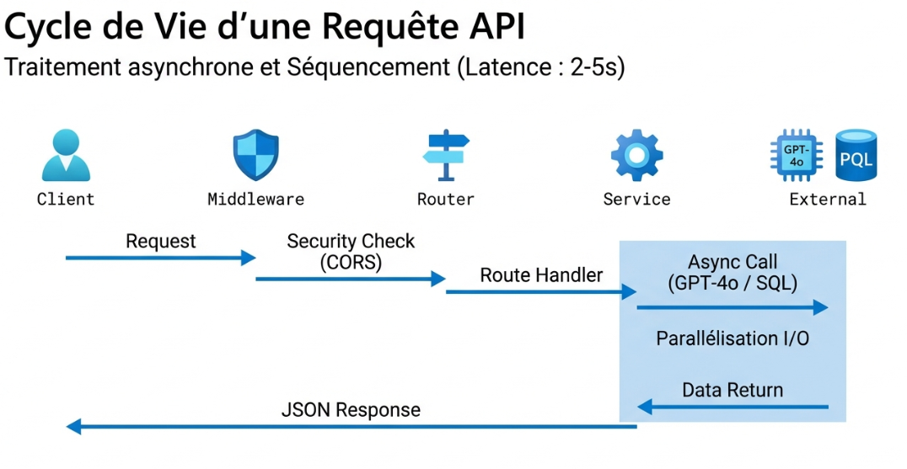
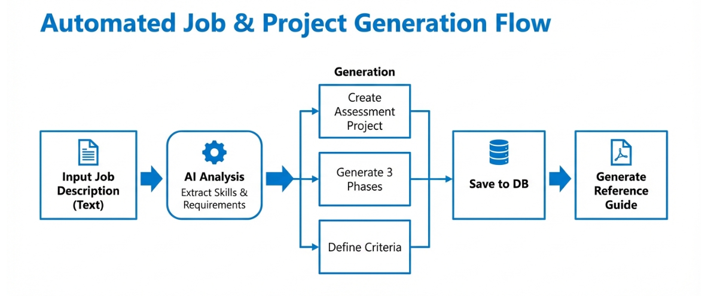
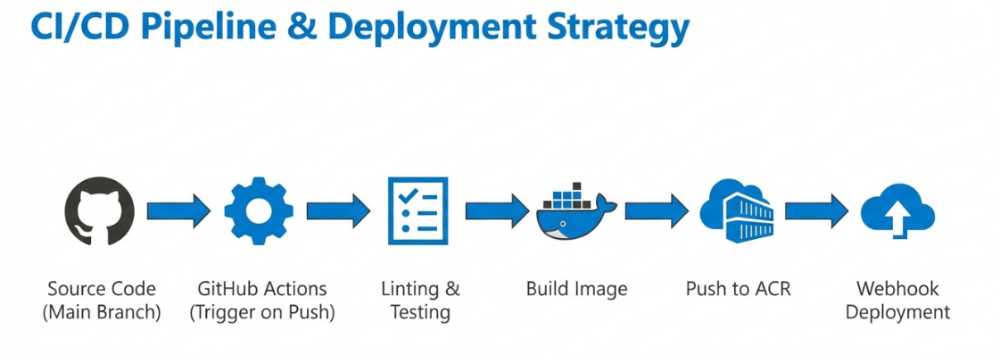
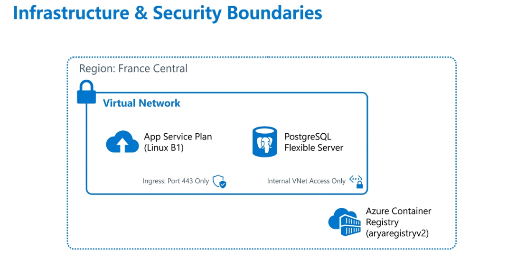

# ARYA API

**AI-Powered Recruitment Assessment Platform**

[](https://python.org)
[](https://fastapi.tiangolo.com)
[](https://azure.microsoft.com)
[](LICENSE)

ARYA (AI Recruitment & Yield Assessment) is an enterprise-grade API platform that transforms traditional hiring processes using AI technology. Built with a multi-agent architecture, ARYA automates and enhances candidate evaluation workflows.

**Live API:** https://arya-recruitment-api-v2.azurewebsites.net

---

## Table of Contents

- [Overview](#overview)
- [Author](#author)
- [Features](#features)
- [Architecture](#architecture)
- [Getting Started](#getting-started)
- [API Reference](#api-reference)
- [Deployment](#deployment)
- [Documentation](#documentation)
- [Contributing](#contributing)
- [License](#license)

---

## Overview

### Problem Statement

Traditional recruitment processes face significant challenges:

| Challenge | Business Impact |
|-----------|-----------------|
| Manual CV screening | 23+ hours per hire on average |
| Inconsistent evaluation criteria | Subjective bias in assessments |
| Lack of data-driven decisions | Poor hire quality predictions |
| Repetitive assessment creation | Inefficient use of HR resources |

### Solution

ARYA addresses these challenges through intelligent automation:

| Feature | Description |
|---------|-------------|
| **AI-Powered Job Analysis** | Automatically extracts skills and requirements from job descriptions |
| **Smart Assessment Generation** | Creates role-specific, AI-resistant evaluation projects |
| **Intelligent CV Evaluation** | Objective scoring against job criteria |
| **Data-Driven Rankings** | Weighted algorithms for fair candidate comparison |
| **Professional Reporting** | Automated PDF generation for stakeholders |

---

## Author

<table>
  <tr>
    <td width="150">
      
    </td>
    <td>
      <h3>Mohamed Amine Elabidi</h3>
      <p><strong>AI & Data Engineer</strong></p>
      <p>Specializing in building intelligent systems that solve real-world business problems.</p>
      <p><strong>Focus Areas:</strong></p>
      <ul>
        <li>Artificial Intelligence - LLMs, NLP, Machine Learning</li>
        <li>Data Engineering - Pipelines, ETL, Data Architecture</li>
        <li>Cloud Computing - Azure, AWS, Containerization</li>
        <li>System Design - Microservices, Multi-Agent Architectures</li>
      </ul>
      <p>
        <a href="https://github.com/mohamedamineelabidi">GitHub</a> |
        <a href="https://www.linkedin.com/in/maelabidi">LinkedIn</a>
      </p>
    </td>
  </tr>
</table>

---

## Features

### Multi-Agent System

ARYA implements a sophisticated multi-agent architecture where specialized agents handle different aspects of the recruitment process:

- **Jobs Agent** - Job creation, assessment generation, rankings retrieval
- **Candidates Agent** - Registration, CV upload, evaluation reports
- **Submissions Agent** - Project submission handling, evaluation triggering
- **Evaluation Service** - CV scoring, submission evaluation, ranking calculation
- **PDF Service** - Document generation for reports and guides

### Scoring Algorithm

Candidates are evaluated using a weighted scoring formula:

```
Final Score = (CV Score × 0.30) + (Average Project Score × 0.70)
```

| Score Range | Level | Recommendation |
|-------------|-------|----------------|
| 90-100 | Outstanding | Strong recommend for immediate hire |
| 80-89 | Excellent | Recommend for hire |
| 70-79 | Good | Consider with development potential |
| 60-69 | Fair | Proceed with caution |
| < 60 | Below Expectations | Not recommended |

---

## Architecture

### High-Level Overview

<!-- Architecture Diagram -->
<div align="center">
  
  <br/>
  <em>Figure 1: ARYA Multi-Agent System Architecture</em>
</div>

<br/>

### Master Architecture Blueprint

<div align="center">
  
  <br/>
  <em>Figure 2: Complete System Blueprint</em>
</div>

<br/>

### Azure Infrastructure

<div align="center">
  
  <br/>
  <em>Figure 3: Azure Cloud Infrastructure</em>
</div>

<br/>

### Database Schema

<div align="center">
  
  <br/>
  <em>Figure 4: Database Entity Relationship Diagram</em>
</div>

<br/>

### API Request Flow

<div align="center">
  
  <br/>
  <em>Figure 5: API Request Processing Flow</em>
</div>

<br/>

### Job Creation Workflow

<div align="center">
  
  <br/>
  <em>Figure 6: Automated Job and Project Generation Flow</em>
</div>

<br/>

### CI/CD Pipeline

<div align="center">
  
  <br/>
  <em>Figure 7: Continuous Integration and Deployment Pipeline</em>
</div>

<br/>

### Security Architecture

<div align="center">
  
  <br/>
  <em>Figure 8: Infrastructure Security Layers</em>
</div>

<br/>

### Technology Stack

| Category | Technology | Purpose |
|----------|------------|---------|
| **Framework** | FastAPI 0.109+ | High-performance async API |
| **ORM** | SQLAlchemy 2.x | Database abstraction |
| **Validation** | Pydantic v2 | Request/response validation |
| **AI** | Azure OpenAI (GPT-4o) | NLP and content generation |
| **Database** | PostgreSQL 14+ | Production data storage |
| **PDF** | FPDF + PyPDF2 | Document generation and parsing |
| **Container** | Docker | Application containerization |
| **Cloud** | Azure App Service | Production hosting |
| **CI/CD** | GitHub Actions | Automated testing and deployment |

For detailed architecture diagrams, see [Architecture Documentation](docs/ARCHITECTURE_DIAGRAMS.md).

---

## Getting Started

### Prerequisites

- Python 3.11 or higher
- PostgreSQL (production) or SQLite (development)
- Azure OpenAI API access

### Installation

1. **Clone the repository**

```bash
git clone https://github.com/mohamedamineelabidi/Multiagent-Recruitment.git
cd Multiagent-Recruitment
```

2. **Create virtual environment**

```bash
python -m venv venv
source venv/bin/activate  # Windows: venv\Scripts\activate
```

3. **Install dependencies**

```bash
pip install -r requirements.txt
```

4. **Configure environment**

```bash
cp .env.example .env
# Edit .env with your credentials
```

5. **Run the application**

```bash
uvicorn app.main:app --reload
```

The API will be available at `http://localhost:8000`.

### Docker Deployment

```bash
# Build image
docker build -t arya-api .

# Run container
docker run -p 8000:8000 --env-file .env arya-api
```

---

## API Reference

### Base URL

- **Production:** `https://arya-recruitment-api-v2.azurewebsites.net`
- **Development:** `http://localhost:8000`

### Interactive Documentation

- **Swagger UI:** `/docs`
- **ReDoc:** `/redoc`

### Endpoints

#### Jobs

| Method | Endpoint | Description |
|--------|----------|-------------|
| POST | `/api/v1/jobs` | Create job with AI-generated assessment |
| GET | `/api/v1/jobs/{id}` | Retrieve job details |
| GET | `/api/v1/jobs/{id}/reference-guide` | Download evaluator PDF guide |
| GET | `/api/v1/jobs/{id}/rankings` | Get ranked candidate list |

#### Candidates

| Method | Endpoint | Description |
|--------|----------|-------------|
| POST | `/api/v1/jobs/{id}/candidates` | Register new candidate |
| POST | `/api/v1/candidates/{id}/cv` | Upload and evaluate CV (PDF) |
| GET | `/api/v1/candidates/{id}/report` | Download evaluation report |

#### Submissions

| Method | Endpoint | Description |
|--------|----------|-------------|
| POST | `/api/v1/candidates/{id}/submissions` | Submit project phase work |
| GET | `/api/v1/candidates/{id}/submissions` | Get all submissions |
| GET | `/api/v1/candidates/{id}/submissions/{phase}` | Get specific phase details |

---

## Deployment

### Azure Infrastructure

The application is deployed on Microsoft Azure with the following components:

| Component | Azure Service | Configuration |
|-----------|---------------|---------------|
| API Server | App Service | Linux B1 |
| Database | PostgreSQL Flexible Server | Burstable B1ms |
| AI Service | Azure OpenAI | GPT-4o model |
| Container Registry | Azure Container Registry | Basic tier |
| Region | France Central | - |

For detailed deployment instructions, see [Deployment Guide](DEPLOYMENT.md).

---

## Documentation

| Document | Description |
|----------|-------------|
| [Architecture Diagrams](docs/ARCHITECTURE_DIAGRAMS.md) | Visual system architecture documentation |
| [Azure Architecture](docs/AZURE_ARCHITECTURE.md) | Azure cloud infrastructure details |
| [System Analysis](docs/SYSTEM_ARCHITECTURE_ANALYSIS.md) | Detailed technical analysis |
| [Deployment Guide](DEPLOYMENT.md) | Azure deployment instructions |
| [Contributing Guide](CONTRIBUTING.md) | Contribution guidelines |
| [Changelog](CHANGELOG.md) | Version history |
| [Security Policy](SECURITY.md) | Security guidelines |

---

## Project Structure

```
Multiagent-Recruitment/
├── app/
│   ├── api/v1/
│   │   ├── endpoints/
│   │   │   ├── jobs.py
│   │   │   ├── candidates.py
│   │   │   └── submissions.py
│   │   └── schemas.py
│   ├── core/
│   │   ├── config.py
│   │   └── db.py
│   ├── models/
│   │   ├── job.py
│   │   ├── candidate.py
│   │   ├── project.py
│   │   └── submission.py
│   ├── services/
│   │   ├── openai_service.py
│   │   ├── project_service.py
│   │   ├── evaluation_service.py
│   │   └── pdf_service.py
│   └── main.py
├── docs/
├── scripts/
├── .github/
├── Dockerfile
├── requirements.txt
└── README.md
```

---

## Contributing

Contributions are welcome. Please read the [Contributing Guide](CONTRIBUTING.md) before submitting a pull request.

1. Fork the repository
2. Create a feature branch (`git checkout -b feature/new-feature`)
3. Commit your changes (`git commit -m 'feat: add new feature'`)
4. Push to the branch (`git push origin feature/new-feature`)
5. Open a Pull Request

---

## License

This project is licensed under the MIT License. See the [LICENSE](LICENSE) file for details.

---

## Acknowledgments

- [FastAPI](https://fastapi.tiangolo.com/) - Modern Python web framework
- [SQLAlchemy](https://www.sqlalchemy.org/) - SQL toolkit and ORM
- [Azure OpenAI](https://azure.microsoft.com/products/ai-services/openai-service) - AI services platform

---

**ARYA Multi-Agent Recruitment System**

Copyright (c) 2026 Mohamed Amine Elabidi
