# ARYA System Architecture Diagrams

**Version:** 2.0  
**Last Updated:** February 2026  
**Author:** Mohamed Amine Elabidi

---

## Table of Contents

1. [System Overview](#1-system-overview)
2. [Multi-Agent Architecture](#2-multi-agent-architecture)
3. [Data Flow Diagrams](#3-data-flow-diagrams)
4. [API Request Flow](#4-api-request-flow)
5. [Database Schema](#5-database-schema)
6. [Deployment Architecture](#6-deployment-architecture)
7. [Sequence Diagrams](#7-sequence-diagrams)
8. [Component Diagrams](#8-component-diagrams)
9. [State Machine Diagrams](#9-state-machine-diagrams)

---

## 1. System Overview

### 1.1 High-Level Architecture

The ARYA system follows a modern cloud-native architecture deployed on Microsoft Azure. The platform integrates multiple services to provide intelligent recruitment assessment capabilities.

<!-- High-Level Architecture Diagram -->
<div align="center">
  
  <br/>
  <em>Figure 1.1: ARYA High-Level System Architecture</em>
</div>

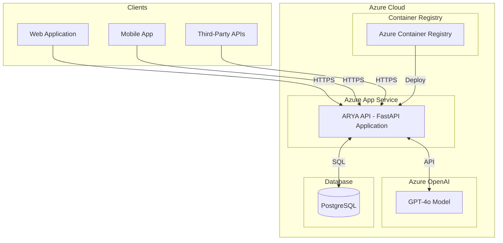

### 1.2 Technology Stack Overview

<!-- IMAGE PLACEHOLDER: Technology Stack Diagram -->
<div align="center">
  
  <br/>
  <em>Figure 1.2: Technology Stack Overview</em>
</div>

| Layer | Technology | Purpose |
|-------|------------|---------|
| **Presentation** | Swagger UI, ReDoc | API Documentation |
| **API** | FastAPI 0.109+ | Request handling, routing |
| **Business Logic** | Python Services | Core business operations |
| **Data Access** | SQLAlchemy 2.x | ORM, database abstraction |
| **Database** | PostgreSQL 14+ | Data persistence |
| **AI Services** | Azure OpenAI GPT-4o | NLP, content generation |
| **Infrastructure** | Azure App Service | Cloud hosting |

---

## 2. Multi-Agent Architecture

### 2.1 Agent Hierarchy

The ARYA platform implements a multi-agent architecture pattern where each agent has specialized responsibilities. This design ensures separation of concerns, maintainability, and scalability.

<!-- IMAGE PLACEHOLDER: Agent Hierarchy Diagram -->
<div align="center">
  
  <br/>
  <em>Figure 2.1: Multi-Agent Hierarchy</em>
</div>

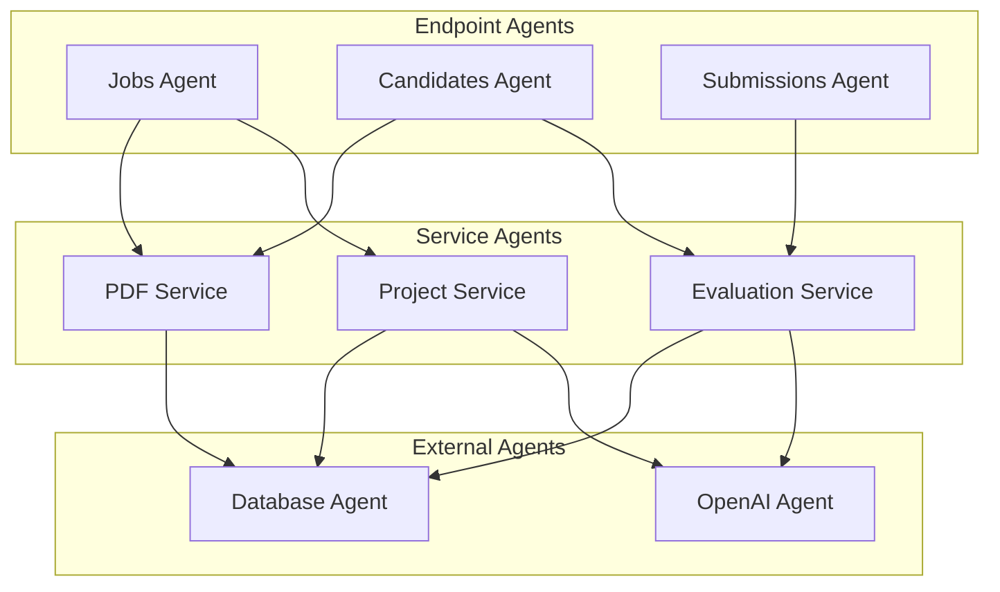

### 2.2 Agent Responsibilities

| Agent | Type | Responsibilities |
|-------|------|------------------|
| **Jobs Agent** | Endpoint | Job creation, retrieval, rankings management |
| **Candidates Agent** | Endpoint | Candidate registration, CV processing, report generation |
| **Submissions Agent** | Endpoint | Project submission handling, evaluation triggering |
| **Project Service** | Service | Job workflow orchestration, assessment generation |
| **Evaluation Service** | Service | CV scoring, submission evaluation, ranking calculation |
| **PDF Service** | Service | Document generation, PDF parsing |
| **OpenAI Agent** | External | AI-powered analysis and content generation |
| **Database Agent** | External | Data persistence, query execution |

### 2.3 Agent Communication Flow

<!-- IMAGE PLACEHOLDER: Agent Communication Flow -->
<div align="center">
  
  <br/>
  <em>Figure 2.2: Agent Communication Flow</em>
</div>

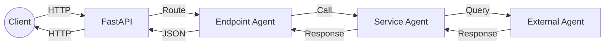

---

## 3. Data Flow Diagrams

### 3.1 Job Creation Flow

This diagram illustrates the complete flow from job description input to assessment project generation.

<!-- IMAGE PLACEHOLDER: Job Creation Flow -->
<div align="center">
  
  <br/>
  <em>Figure 3.1: Job Creation Data Flow</em>
</div>

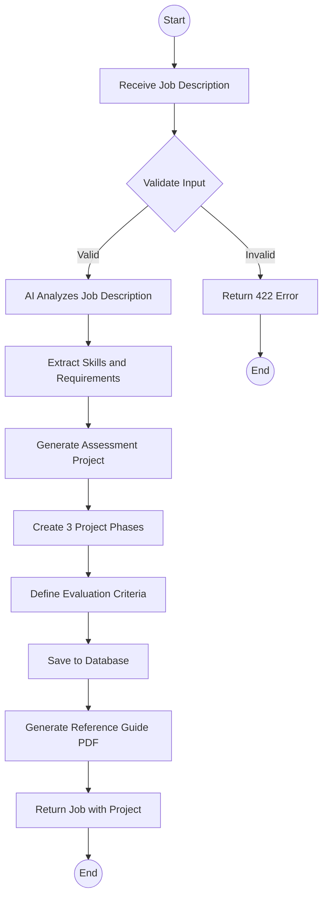

**Process Steps:**

1. **Input Validation** - Verify required fields and data format
2. **AI Analysis** - GPT-4o extracts skills and requirements from job description
3. **Project Generation** - AI creates role-specific assessment project
4. **Phase Creation** - Generate three progressive evaluation phases
5. **Criteria Definition** - Establish scoring criteria for each phase
6. **Persistence** - Save job and project to database
7. **PDF Generation** - Create reference guide for evaluators

### 3.2 CV Evaluation Flow

<!-- IMAGE PLACEHOLDER: CV Evaluation Flow -->
<div align="center">
  
  <br/>
  <em>Figure 3.2: CV Evaluation Data Flow</em>
</div>

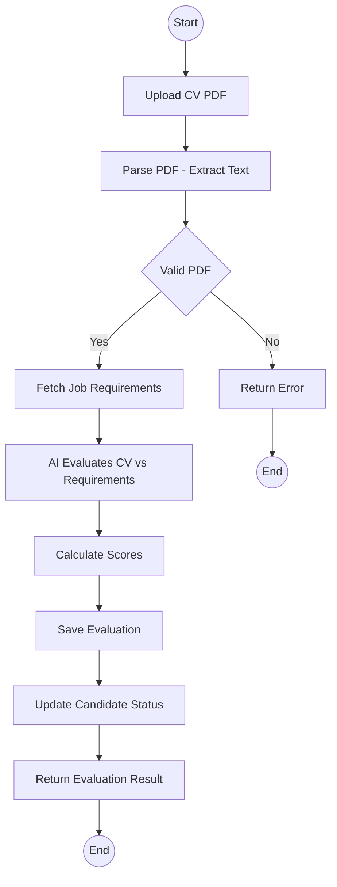

### 3.3 Candidate Ranking Flow

<!-- IMAGE PLACEHOLDER: Ranking Algorithm Flow -->
<div align="center">
  
  <br/>
  <em>Figure 3.3: Candidate Ranking Algorithm</em>
</div>

**Scoring Formula:**

```
Final Score = (CV Score × 0.30) + (Average Project Score × 0.70)
```

| Component | Weight | Description |
|-----------|--------|-------------|
| CV Score | 30% | Skills match, experience fit, industry relevance |
| Project Score | 70% | Average of all phase submission scores |

---

## 4. API Request Flow

### 4.1 Request Lifecycle

<!-- IMAGE PLACEHOLDER: Request Lifecycle -->
<div align="center">
  
  <br/>
  <em>Figure 4.1: Complete API Request Lifecycle</em>
</div>

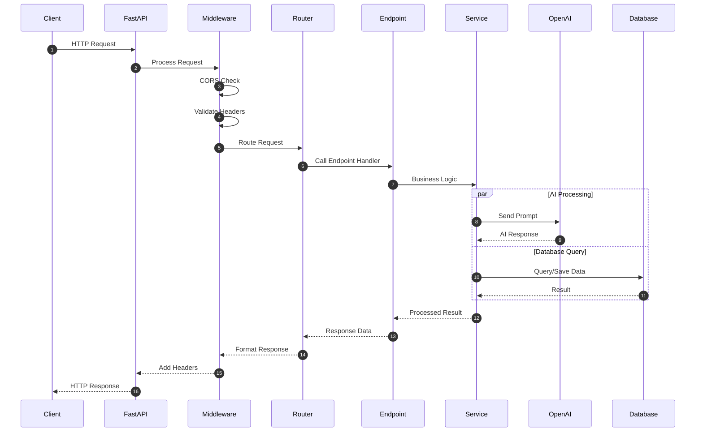

### 4.2 Error Handling

| HTTP Status | Error Type | Description |
|-------------|------------|-------------|
| 400 | Bad Request | Malformed request syntax |
| 401 | Unauthorized | Authentication required |
| 404 | Not Found | Resource does not exist |
| 422 | Unprocessable Entity | Validation error |
| 500 | Internal Server Error | Unexpected server error |
| 503 | Service Unavailable | External service failure |

---

## 5. Database Schema

### 5.1 Entity Relationship Diagram

<!-- IMAGE PLACEHOLDER: Entity Relationship Diagram -->
<div align="center">
  
  <br/>
  <em>Figure 5.1: Database Entity Relationship Diagram</em>
</div>

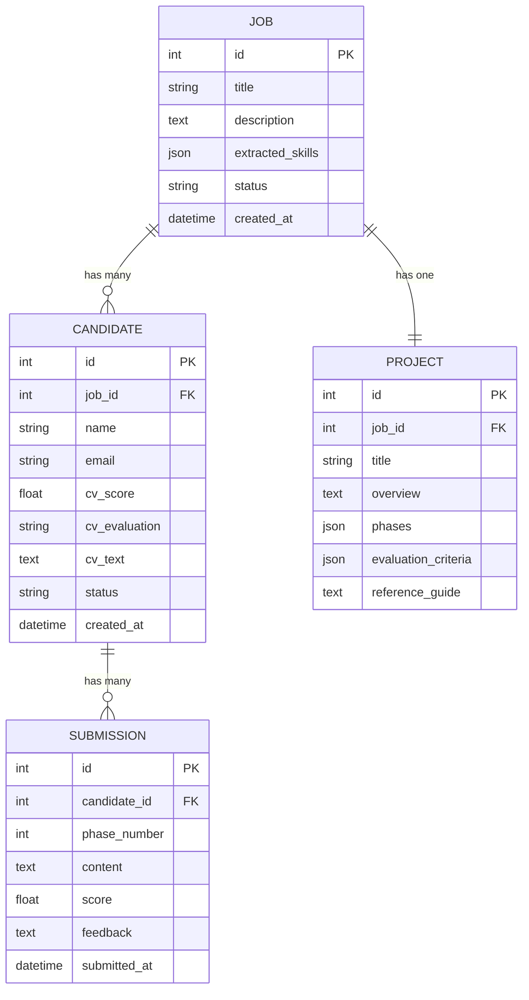

### 5.2 Table Specifications

#### Jobs Table

| Column | Type | Constraints | Description |
|--------|------|-------------|-------------|
| id | INTEGER | PRIMARY KEY | Unique identifier |
| title | VARCHAR(255) | NOT NULL | Job title |
| description | TEXT | NOT NULL | Full job description |
| extracted_skills | JSON | - | AI-extracted skills |
| status | VARCHAR(50) | DEFAULT 'active' | Job status |
| created_at | TIMESTAMP | DEFAULT NOW() | Creation timestamp |

#### Candidates Table

| Column | Type | Constraints | Description |
|--------|------|-------------|-------------|
| id | INTEGER | PRIMARY KEY | Unique identifier |
| job_id | INTEGER | FOREIGN KEY | Reference to jobs |
| name | VARCHAR(255) | NOT NULL | Candidate name |
| email | VARCHAR(255) | NOT NULL, UNIQUE per job | Contact email |
| cv_score | FLOAT | - | CV evaluation score (0-100) |
| cv_evaluation | TEXT | - | AI evaluation summary |
| cv_text | TEXT | - | Extracted CV content |
| status | VARCHAR(50) | DEFAULT 'registered' | Candidate status |
| created_at | TIMESTAMP | DEFAULT NOW() | Registration timestamp |

---

## 6. Deployment Architecture

### 6.1 Azure Infrastructure

<!-- IMAGE PLACEHOLDER: Azure Infrastructure Diagram -->
<div align="center">
  
  <br/>
  <em>Figure 6.1: Azure Cloud Infrastructure</em>
</div>

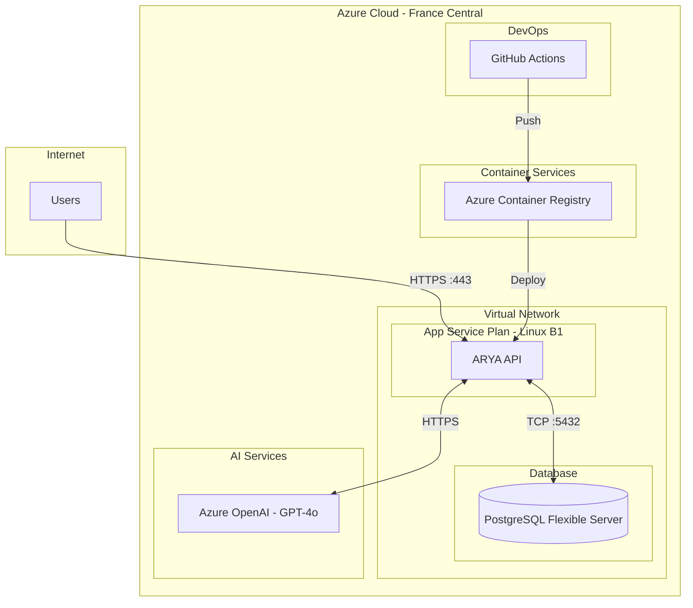

### 6.2 Infrastructure Components

| Component | Azure Service | SKU/Tier | Purpose |
|-----------|--------------|----------|---------|
| **API Server** | App Service | Linux B1 | Application hosting |
| **Database** | PostgreSQL Flexible Server | Burstable B1ms | Data persistence |
| **AI Service** | Azure OpenAI | Standard | GPT-4o model access |
| **Container Registry** | Container Registry | Basic | Docker image storage |
| **CI/CD** | GitHub Actions | - | Automated deployment |

### 6.3 CI/CD Pipeline

<!-- IMAGE PLACEHOLDER: CI/CD Pipeline -->
<div align="center">
  
  <br/>
  <em>Figure 6.2: Continuous Integration and Deployment Pipeline</em>
</div>

```mermaid
flowchart LR
    subgraph "Development"
        DEV[Developer]
        CODE[Code Changes]
    end
    
    subgraph "GitHub"
        REPO[Repository]
        PR[Pull Request]
        MAIN[Main Branch]
    end
    
    subgraph "GitHub Actions"
        LINT[Lint]
        TEST[Test]
        BUILD[Build Image]
        PUSH[Push to ACR]
    end
    
    subgraph "Azure"
        ACR[Container Registry]
        APP[App Service]
    end
    
    DEV --> CODE
    CODE --> REPO
    REPO --> PR
    PR --> MAIN
    MAIN --> LINT
    LINT --> TEST
    TEST --> BUILD
    BUILD --> PUSH
    PUSH --> ACR
    ACR --> APP
```

---

## 7. Sequence Diagrams

### 7.1 Job Creation Sequence

<!-- IMAGE PLACEHOLDER: Job Creation Sequence -->
<div align="center">
  
  <br/>
  <em>Figure 7.1: Job Creation Sequence Diagram</em>
</div>

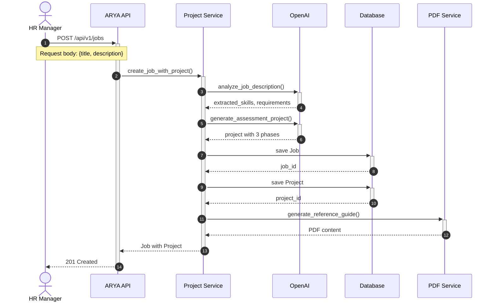

### 7.2 Candidate Registration and CV Upload

<!-- IMAGE PLACEHOLDER: Candidate Flow Sequence -->
<div align="center">
  
  <br/>
  <em>Figure 7.2: Candidate Registration and CV Upload Sequence</em>
</div>

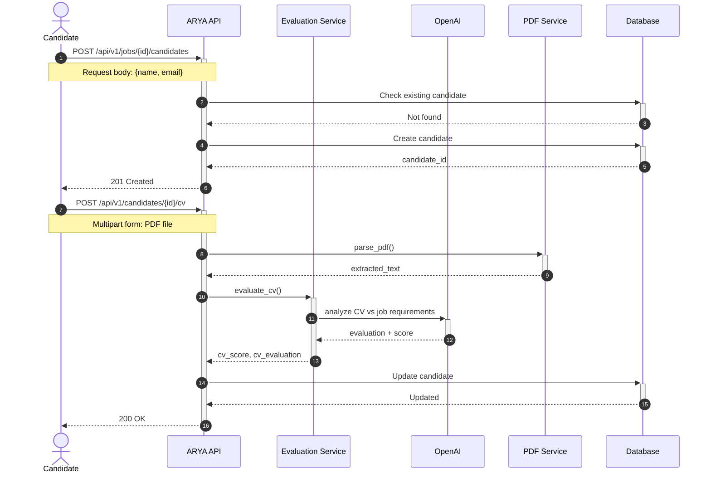

---

## 8. Component Diagrams

### 8.1 Application Components

<!-- IMAGE PLACEHOLDER: Application Components -->
<div align="center">
  
  <br/>
  <em>Figure 8.1: Application Component Architecture</em>
</div>

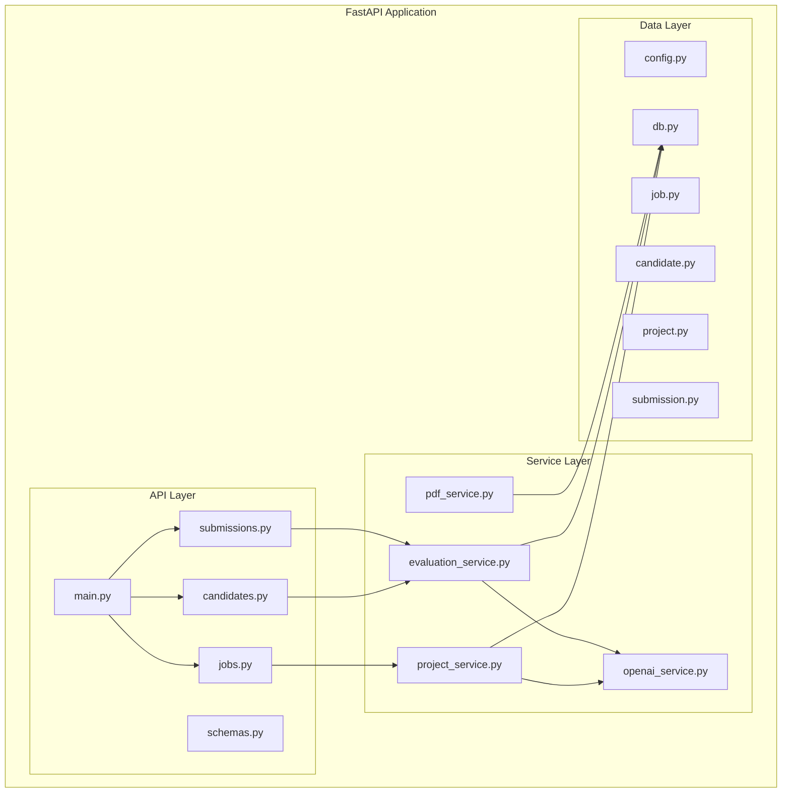

### 8.2 Directory Structure

```
app/
├── api/
│   └── v1/
│       ├── endpoints/
│       │   ├── jobs.py           # Job endpoints
│       │   ├── candidates.py     # Candidate endpoints
│       │   └── submissions.py    # Submission endpoints
│       └── schemas.py            # Pydantic models
├── core/
│   ├── config.py                 # Configuration
│   └── db.py                     # Database setup
├── models/
│   ├── job.py                    # Job ORM model
│   ├── candidate.py              # Candidate ORM model
│   ├── project.py                # Project ORM model
│   └── submission.py             # Submission ORM model
├── services/
│   ├── openai_service.py         # AI integration
│   ├── project_service.py        # Job orchestration
│   ├── evaluation_service.py     # Scoring logic
│   └── pdf_service.py            # PDF generation
└── main.py                       # Application entry
```

---

## 9. State Machine Diagrams

### 9.1 Job Lifecycle

<!-- IMAGE PLACEHOLDER: Job State Machine -->
<div align="center">
  
  <br/>
  <em>Figure 9.1: Job State Machine</em>
</div>

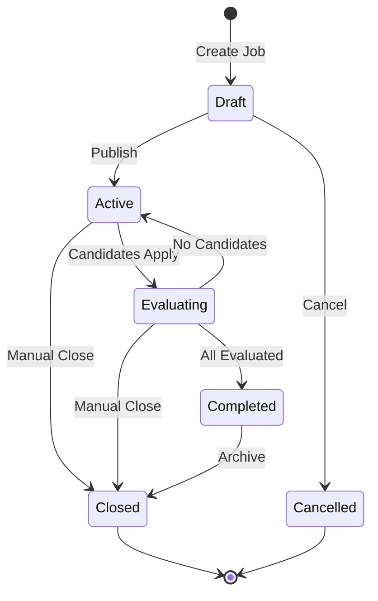

| State | Description | Allowed Transitions |
|-------|-------------|---------------------|
| **Draft** | Job created, not yet published | Active, Cancelled |
| **Active** | Accepting candidate applications | Evaluating, Closed |
| **Evaluating** | Processing candidate submissions | Active, Completed, Closed |
| **Completed** | All evaluations finished | Closed |
| **Closed** | Job archived | Terminal |
| **Cancelled** | Job cancelled before publishing | Terminal |

### 9.2 Candidate Lifecycle

<!-- IMAGE PLACEHOLDER: Candidate State Machine -->
<div align="center">
  
  <br/>
  <em>Figure 9.2: Candidate State Machine</em>
</div>

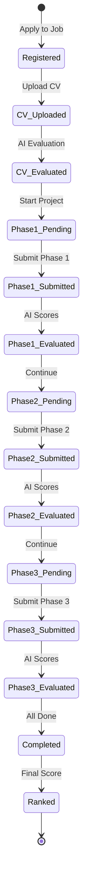

---

## Appendix A: Image Assets

The following image placeholders should be replaced with actual diagram exports:

| Figure | Filename | Recommended Format | Dimensions |
|--------|----------|-------------------|------------|
| 1.1 | high-level-architecture.png | PNG | 1600x900 |
| 1.2 | technology-stack.png | PNG | 1400x800 |
| 2.1 | agent-hierarchy.png | PNG | 1600x1000 |
| 2.2 | agent-communication.png | PNG | 1400x600 |
| 3.1 | job-creation-flow.png | PNG | 1600x1200 |
| 3.2 | cv-evaluation-flow.png | PNG | 1600x1000 |
| 3.3 | ranking-flow.png | PNG | 1400x600 |
| 4.1 | request-lifecycle.png | PNG | 1600x1000 |
| 5.1 | erd.png | PNG | 1600x900 |
| 6.1 | azure-infrastructure.png | PNG | 1600x1000 |
| 6.2 | cicd-pipeline.png | PNG | 1600x600 |
| 7.1 | sequence-job-creation.png | PNG | 1600x1200 |
| 7.2 | sequence-candidate-flow.png | PNG | 1600x1200 |
| 8.1 | application-components.png | PNG | 1600x1200 |
| 9.1 | state-job-lifecycle.png | PNG | 1400x800 |
| 9.2 | state-candidate-lifecycle.png | PNG | 1600x1000 |

**Directory structure for assets:**
```
assets/
└── diagrams/
    ├── high-level-architecture.png
    ├── technology-stack.png
    ├── agent-hierarchy.png
    └── ...
```

---

## Appendix B: Diagram Tools

Recommended tools for creating and exporting diagrams:

| Tool | Purpose | Export Formats |
|------|---------|----------------|
| [Draw.io](https://draw.io) | General diagrams | PNG, SVG, PDF |
| [Lucidchart](https://lucidchart.com) | Professional diagrams | PNG, SVG, PDF |
| [Mermaid Live](https://mermaid.live) | Mermaid rendering | PNG, SVG |
| [PlantUML](https://plantuml.com) | UML diagrams | PNG, SVG |
| [Excalidraw](https://excalidraw.com) | Hand-drawn style | PNG, SVG |

---

## References

- [FastAPI Documentation](https://fastapi.tiangolo.com/)
- [SQLAlchemy Documentation](https://docs.sqlalchemy.org/)
- [Azure OpenAI Service](https://learn.microsoft.com/azure/ai-services/openai/)
- [Azure App Service Documentation](https://learn.microsoft.com/azure/app-service/)
- [Mermaid Diagram Syntax](https://mermaid.js.org/intro/)

---

**Document Control**

| Version | Date | Author | Changes |
|---------|------|--------|---------|
| 1.0 | January 2026 | Mohamed Amine Elabidi | Initial version |
| 2.0 | February 2026 | Mohamed Amine Elabidi | Added image placeholders, professional formatting |

---

*This document is part of the ARYA Multi-Agent Recruitment System technical documentation.*
